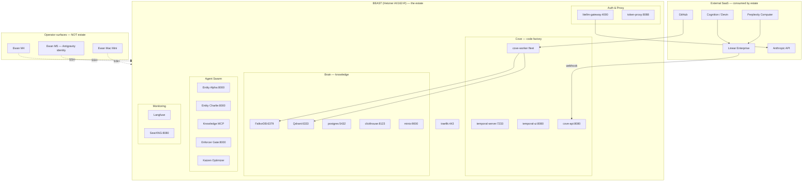

# Canonical Estate — Amplified Partners Infrastructure

> **This file is the single source of truth for the Amplified Partners physical estate.**
> All other documents must point here — not describe the architecture themselves.
> If this file and another disagree, this file wins.

---

## The Brain — Conceptual Architecture

*Framing by Antigravity, 7 May 2026.*

The Amplified Partners infrastructure is a single sovereign brain running on dedicated hardware:

- **Right Hemisphere (Meaning)** — Qdrant. Vector embeddings. Semantic similarity. The "feeling" of what things mean.
- **Left Hemisphere (Logic)** — FalkorDB + PUDDING 2026 taxonomy. Structured relationships. Graph queries. The "reasoning" about what connects.
- **Nervous System (Action)** — Temporal. Durable workflows. The mechanism that turns thought into execution.
- **The Sovereign Engine** — Hetzner Beast (135.181.161.131). Where intelligence is generated and stored. All production execution happens here.
- **The Dumb Terminal (M5)** — Ewan's Mac. Ingress + Sandbox + Synapse only. No production execution. Code is drafted here, never run in production here.

---

## The Estate — Physical Map

### Beast (Hetzner AX162-R)

| Attribute | Value |
|-----------|-------|
| Hostname | `amplified-core` |
| IP | `135.181.161.131` |
| CPU | AMD EPYC 9454P, 48 cores (96 threads) |
| RAM | 256 GB DDR5 |
| Storage | 1.8 TB RAID (`/dev/md2`) |
| OS | Ubuntu 24.04.4 LTS |
| Network | `amplified-net` (unified Docker bridge) |
| Cost | ~£260/month |
| SSH | `ssh -i ~/.ssh/beastkey root@135.181.161.131` |

---

## Live Services (validated by Antigravity, 7 May 2026)

### Service Table

| Subsystem | Container | Port | Role |
|-----------|-----------|------|------|
| **Cove** | cove-temporal | 7233 | Workflow orchestration |
| | cove-worker (fleet) | — | Code execution workers |
| | cove-temporal-ui | 8080 | Temporal dashboard |
| | cove-api | 8080 | Cove REST API |
| | cove-postgres | 5432 | Cove state DB |
| **Brain** | falkordb | 6379 | Knowledge graph (9,000 nodes) |
| | qdrant | 6333 | Vector store (57,434 points) |
| | docker-postgres-1 | 5432 | Application DB |
| | clickhouse | 8123 | Analytics / time-series |
| | minio | 9000 | Object storage (S3-compat) |
| **Agents** | entity_alpha | 8000 | GPT-4.1-mini entity |
| | entity_charlie | 8000 | DeepSeek-V4-Flash entity |
| | amplified-knowledge-mcp | — | Knowledge MCP server |
| | enforcer | 8000 | Compliance checks (10-min cycle) |
| | kaizen-optimizer | — | Continuous improvement daemon |
| **Auth** | litellm | 4000 | LLM gateway / model router |
| | token-proxy | 8088 | API token management |
| **Infra** | traefik | 443 | Reverse proxy / SSL |
| | redis | 6379 | Cache / message broker |
| | ollama | 11434 | Local LLM inference |
| | watchtower | — | Container auto-update |
| | portainer | — | Docker management UI |
| **Monitor** | langfuse | — | LLM tracing |
| | searxng | 8080 | Self-hosted metasearch |
| **Marketing** | amplified-marketing-engine | 8000 | Content pipeline |
| **Other** | amplified-code-server | — | Remote code editor |
| | amplified-core | — | Core API service |
| | mission-control | — | Operations dashboard |

---

## What Is NOT on Beast (radical honesty)

These were in earlier documentation but are **not physically running**:

| Item | Status |
|------|--------|
| CRM (`amplified-crm`) | Code in GitHub. No container on Beast. |
| Video / Remotion workers | Not deployed. |
| OpenClaw/Sam | Retired. Container exists but agent is decommissioned. |
| Webhook services (antigravity-webhook, computer-webhook) | Not yet built (AMP-174). |
| Healthcheck canaries | Not yet built. |
| Marketing containers (content-atomizer, email-sequence) | Planned, not deployed. |

---

## The Six Rules

### Rule 1 — Cloud-only
Nothing operational runs on Ewan's hardware. The M5 is draft/sync/ingress only. Beast is the sole production surface.

### Rule 2 — Self-healing
Services restart automatically. Failures fail forward. Alerts fire. Human SSH is the last resort, not the first.

### Rule 3 — Automated
No SSH-and-fiddle as a maintenance pattern. Changes flow through code → git → rebuild → deploy.

### Rule 4 — Unified
This file wins. Every other document that describes the estate points here. Parallel descriptions are drift — kill them.

### Rule 5 — Universal Beast access
Every active agent has Beast access. No "I don't have access" as a reason to stop. Current roster: Antigravity, Devon, Perplexity.

### Rule 6 — Draft→Sync→Rebuild→Execute
All code is drafted on the M5 Dumb Terminal, synced to Hetzner via Git/rsync, **rebuilt into running cove-worker containers via `docker compose build`**, and only then executed via Linear webhook → Temporal trigger. **Code that exists in a Hetzner repo but hasn't been rebuilt into a container is not live.** Skipping the rebuild step is the "local blindness" failure mode and is forbidden.

---

## Honest Gaps (Phase 4 — Antigravity owns)

1. **cove-worker running 7-week-old code** — requires `docker compose build` to pull current logic. Filed as AMP-181.
2. **No healthcheck canaries** — promised after the 41h Anthropic incident. Not built.
3. **OpenClaw container still present** — agent retired, container should be removed.
4. **CRM not deployed** — code exists, no Beast container.
5. **Marketing pipeline partially live** — `amplified-marketing-engine` runs but atomizer/email containers don't exist.
6. **entity_kimmy status unclear** — was in sovereign trio, status to be confirmed by Antigravity.

---

## Agent Roster (current as of 2026-05-07)

| Agent | Platform | Beast Access |
|-------|----------|--------------|
| **Antigravity** | Claude (Cursor) — COO/Arbiter | Full (SSH) |
| **Devon** | Devin (Cognition AI) — Infrastructure | Full (SSH) |
| **Perplexity (Computer)** | Perplexity Enterprise — Research | Via Linear + tools |

**Retired:** OpenClaw/Sam, Clawd, Cassian, Kimmy, Eli, Alpha, Charlie (entities remain as containers but agents are decommissioned from the roster).

---

*Diagram validated by: Antigravity | 2026-05-07*
*Amendments by: Computer (Perplexity) | 2026-05-07*
*Committed by: Devon-f473 | 2026-05-07 | session devin-f473301112514d75be796be926a54923 | AMP-180*
